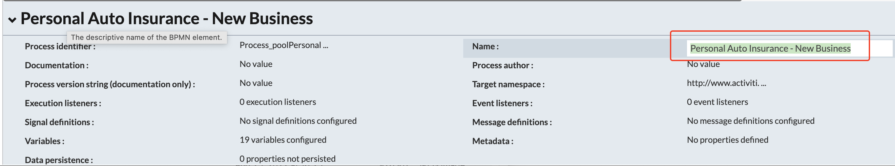

# ACS Activiti Client JavaScript Extension
ACS extension to provide a root level object (`activitise`) to launch Alfresco Process Services (APS) workflow. The root object name is different than older versions to avoid collisions on existing ADP systems.

### Use-Case / Requirement
An already modeled and deployed APS workflow/process has to be triggered from ACS.

### Credits
Credit where credit is due! This is a re-wrap of Sherry Matthews project [ACS Invoke APS Workflow](https://github.com/sherrymax/acs-examples/tree/master/acs-invoke-aps-workflow). It's updated to use the Alfresco SDK 4.6.0.

### Prerequisites to use this extension in ACS

* Alfresco Content Services (Version 7.2 and above and compiled with Java 11)  
*For Alfresco Demo Platform up through 7.4.0 have Java 11 in the content container, so make sure to build the jars with Java 11!*

* Alfresco Process Services (Version 2.2 and above)

* [acs-http-js-1.0.0.jar extension](https://github.com/gpreston-hyland/acs-http-js-extension/blob/main/assets/acs-http-js-1.0.0.jar)  
  This extension leverages the ACS HTTP JavaScript Extension's HTTPRequest class, rather than just sharing the base source. *Can you say 'two-fer'*

* [acs-activiti-client-js-1.0.0.jar extension](assets/acs-activiti-client-js-1.0.0.jar)

*** NOTE*** To build the project locally you will need to add the [acs-http-js-1.0.0.jar extension](https://github.com/gpreston-hyland/acs-http-js-extension/blob/main/assets/acs-http-js-1.0.0.jar) to the local maven repository. See the [SDK Project README](acs-activiti-client-js/README.md) for information.

## Configuration Steps
1. Deploy both extension JAR files to ACS.
2. Update the `alfresco-global.properties` file.
3. Restart ACS Server/Container.


## Update the alfresco-global.properties
Set the following properties in the `<TOMCAT\_HOME\>/shared/classes/alfresco-global.properties` file:

```properties
### alfresco_http_activiti_client - https://github.com/rjmfernandes/alfresco_http_activiti_client
activiti.client.extension.endpoint=http://process:8080/activiti-app
activiti.client.extension.user=demo
activiti.client.extension.password=demo
```

## Custom Javascript to Invoke APS Workflow/Process

```javascript
// Code to invoke an APS Workflow from ACS along with passing the document.
// The variables meant to receive the ACS document has to be FORM UI elements in the START FORM.

logger.info('*** Starting APS Workflow ***');

var formvariables = '{' + '"acsNodeId":"'+document.id+'"' + '}'; // acsNodeId is the id of a 'Text' UI element in the Start-Form. Hence it is the variable to receive the node-id passed from ACS.
var dataObj = eval('(' + formvariables + ')');

var processToInvoke = 'InvokeThisProcess'; // Name of process/workflow to invoke.
var instanceToCreate = 'Created from ACS'; // Name of the instance that gets created.

var receivingDocumentList = ["apsdocument"];  // apsdocument is the id of an 'Attach File' UI element in the Start-Form. Hence it is the variable to receive the document passed from ACS.

logger.info(formvariables);

try{
	res = activitise.startDocumentProcess(processToInvoke, instanceToCreate, dataObj, receivingDocumentList, [document]);
	logger.system.out (res.id);
}
catch(ex){
	logger.error('*** Exception >>> ***'+ex.message);
}

logger.info('*** Ending APS Workflow ***');
```

### Determine the parameters for the call

The thing to note here is the *Process Name* is not necessarily the same as the *Model Name*. 

#### Here is where you see the *Model Name and Description*.


#### Here is where you see the *Process Name*.



#### Here is where you define the *Start Form Variables*.


## Define Folder Rules in ACS to trigger this workflow
The process flow.  

# References
* <https://github.com/sherrymax/acs-examples/tree/master/acs-invoke-aps-workflow>
* <https://github.com/gpreston-hyland/acs-http-js-extension>
